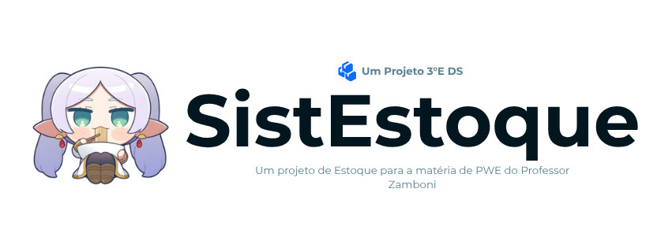

<p align="center">
  
</p>

<br>

<h1 align="center">
  📦 Projeto SistEstoque
</h1>

<p align="center">
  <b>Sistema de Gerenciamento de Estoque de Produtos</b>
  <br>
</p>

<br>

<p align="center">
  
  
  
</p>

<p align="center">
  
  
  
  
</p>

<br>

---

<br>

<p align="center">
  <a href="#-sobre">📖 Sobre</a>
  <b>·</b>
  <a href="#-status">📌 Status</a>
  <b>·</b>
  <a href="#-funcionalidades">✨ Funcionalidades</a>
  <b>·</b>
  <a href="#-tech-stack">🛠 Stack</a>
  <b>·</b>
  <a href="#-arquitetura">🏗 Arquitetura</a>
  <b>·</b>
  <a href="#-executar">🚀 Executar</a>
  <b>·</b>
  <a href="#-banco">🗄 Banco</a>
  <b>·</b>
  <a href="#-api">🧭 API</a>
  <b>·</b>
  <a href="#-seguranca">🛡 Segurança</a>
  <b>·</b>
  <a href="#-desenvolvedores">👥 Devs</a>
</p>

<br>

---

<br>

## 📖 Sobre

<p align="justify">
  O <strong>SistEstoque</strong> é um projeto acadêmico desenvolvido na disciplina de <strong>Programação Web (PWE)</strong>, sob orientação do <strong>Professor Rafael Russi Zamboni</strong>. É um sistema web completo para <strong>gerenciamento de estoque de produtos</strong>, permitindo cadastrar, editar, listar e excluir itens com suporte a imagens, categorias, moedas e países de origem.
</p>

<p align="justify">
  Através de uma interface moderna construída com <strong>Bootstrap 5</strong> e <strong>SweetAlert2</strong>, o sistema oferece uma experiência fluida com modais estilizados, drag-and-drop de imagens, cropper de foto de perfil via <strong>CropperJS</strong> e bandeiras de países via <strong>flag-icons</strong>. Do backend ao frontend, cada componente foi pensado para demonstrar boas práticas de desenvolvimento web com PHP vanilla.
</p>

<br>

<table align="center">
  <tr>
    <td align="center"></td>
    <td align="center"></td>
    <td align="center"></td>
  </tr>
</table>

<br>

---

<br>

<h2 id="-status">📌 Status</h2>

<blockquote>
  <strong>Versão:</strong> 1.0 🎉<br>
  <strong>Lançamento:</strong> Julho de 2026<br>
  <strong>Status:</strong> Concluído ✅
</blockquote>

<p align="justify">
  O desenvolvimento do SistEstoque foi finalizado com todas as funcionalidades planejadas implementadas: autenticação, CRUD completo de produtos, gestão de perfil com upload e cropper de imagens, paginação, filtros e sistema de notificações com SweetAlert2.
</p>

<br>

<blockquote>
  🔔 <strong>Nota:</strong> A funcionalidade de <strong>recuperação de senha</strong> está sinalizada no frontend mas ainda não foi implementada no backend.
</blockquote>

<br>

<p align="center">
  
  
  
  
  
</p>

<br>

---

<br>

<h2 id="-funcionalidades">✨ Funcionalidades</h2>

<br>

<table>
  <tr>
    <td align="center" width="33%">
      <h3>🔐 Autenticação</h3>
      <p>Login seguro com <strong>sessão PHP</strong>, cookie HTTP-only, mensagens de erro genéricas e <strong>password_hash()</strong> com bcrypt.</p>
    </td>
    <td align="center" width="33%">
      <h3>📦 CRUD Produtos</h3>
      <p>Cadastro, edição, listagem e exclusão de produtos com <strong>10 categorias</strong>, 7 moedas e bandeiros de países.</p>
    </td>
    <td align="center" width="33%">
      <h3>📸 Upload de Imagens</h3>
      <p>Upload local com <strong>drag-and-drop</strong> ou vinculação via URL externa. Pré-visualização em tempo real.</p>
    </td>
  </tr>
  <tr>
    <td align="center">
      <h3>👤 Perfil</h3>
      <p>Foto de perfil com <strong>CropperJS</strong> (recorte quadrado 1:1), upload local ou URL. Alteração de nome e senha.</p>
    </td>
    <td align="center">
      <h3>📄 Paginação</h3>
      <p>Lista paginada com <strong>5 itens por página</strong>, navegação completa e parâmetros via query string.</p>
    </td>
    <td align="center">
      <h3>🔍 Filtros</h3>
      <p>Filtrar por <strong>ID, categoria e ordenação por preço</strong> (asc/desc). Combinação de filtros simultâneos.</p>
    </td>
  </tr>
  <tr>
    <td align="center">
      <h3>🎉 Notificações</h3>
      <p><strong>SweetAlert2</strong> em todas as ações — login, logout, cadastro, edição, exclusão, erros e sucesso.</p>
    </td>
    <td align="center">
      <h3>🏳 Bandeiras</h3>
      <p>Helper com <strong>200+ países</strong> mapeados (PT, EN, JP) — exibe bandeira real do país de origem do produto.</p>
    </td>
    <td align="center">
      <h3>🖼 Preview de Imagem</h3>
      <p>Modal de ampliação ao clicar na foto do produto na tabela, com <strong>zoom interativo</strong> e hover scale.</p>
    </td>
  </tr>
</table>

<br>

---

<br>

<h2 id="-tech-stack">🛠 Tech Stack</h2>

<br>

<p align="center">
  
  
  
  
  
  
</p>

<br>

<h3>🎨 Frontend</h3>

| Tecnologia | Aplicação |
|------------|-----------|
| <b>PHP 8.0</b> (vanilla) | Server-Side Includes, componentes reutilizáveis, injeção de templates |
| <b>Bootstrap 5.3</b> | Grid responsivo, cards, modais, formulários, nav-pills e paginasção |
| <b>CSS3</b> | Estilos customizados por página, drop-zones, preview containers e animações |
| <b>JavaScript ES6</b> | Módulos, classes, `FileReader`, `DataTransfer`, `fetch` API |
| <b>SweetAlert2</b> | Modais e notificações estilizadas — substitui alerts nativos |
| <b>CropperJS</b> | Recorte de foto de perfil em formato quadrado (1:1) |
| <b>Font Awesome 6</b> | Iconografia vectorial em todo o sistema |
| <b>Flag Icons</b> | Bandeiras de 200+ países em formato SVG miniatura |
| <b>Plus Jakarta Sans</b> | Tipografia moderna e legível |

<h3>🔧 Backend</h3>

| Tecnologia | Aplicação |
|------------|-----------|
| <b>PHP 8.0</b> (vanilla) | Controllers organizados por ação — sem frameworks, roteamento manual |
| <b>MySQLi</b> | Prepared statements, conexão segura com MariaDB |
| <b>Sessão PHP</b> | Auth com cookie HTTP-only, pasta de sessões do sistema |

<h3>⚙️ Middleware</h3>

| Arquivo | Função |
|---------|--------|
| <code>verificador.php</code> | Função <code>VerificarLogin()</code> — redireciona para login se não houver sessão ativa |

<br>

---

<br>

<h2 id="-arquitetura">🏗 Arquitetura</h2>

<p align="justify">
  O projeto segue uma arquitetura MVC simplificada, com separação clara entre camada de apresentação (PHP + HTML + Bootstrap), lógica de negócio (controllers PHP), e dados (MariaDB via MySQLi).
</p>

<br>

<pre>
📁 SistEstoque/                        # Raiz do projeto
│
├── 📁 api/                           # 🖥️  Backend
│   ├── 📁 config/                    #    └── Conexão MySQLi com MariaDB
│   ├── 📁 controllers/               #    └── Controllers de ação (login, CRUD, upload)
│   │   ├── 📄 doLogin.php            #    └── Autenticação com password_verify()
│   │   ├── 📄 doCadastro.php         #    └── Cadastro de usuários com password_hash()
│   │   ├── 📄 doCadastro_produtos.php#    └── Cadastro de produtos com upload
│   │   ├── 📄 doEditar.php           #    └── Atualização de produtos
│   │   ├── 📄 excluir.php            #    └── Exclusão de produtos
│   │   ├── 📄 logout.php             #    └── Destroi sessão + limpa cookie
│   │   ├── 📄 atualizarPerfil.php    #    └── Upload/crop de foto de perfil
│   │   ├── 📄 atualizarDadosUsuario.php  # └── Atualização de nome e senha
│   │   ├── 📄 update_foto.php        #    └── Upload de foto (legado)
│   │   └── 📄 upload_helper.php      #    └── Funções utilitárias de upload
│   ├── 📁 helpers/                   #    └── Helpers utilitários
│   │   └── 📄 bandeiras_helper.php   #    └── 200+ países → código ISO → bandeira
│   └── 📁 middleware/                #    └── Verificador de sessão
│
├── 📁 public/                        # 🌐  Aplicação web
│   ├── 📄 index.php                  #    └── Router inicial (redireciona p/ login ou lista)
│   ├── 📁 pages/                     #    └── 6 páginas internas
│   │   ├── 📄 login.php              #    └── Tela de login
│   │   ├── 📄 cadastro.php           #    └── Tela de registro
│   │   ├── 📄 lista.php              #    └── Listagem com filtros + paginação
│   │   ├── 📄 cadastro_produtos.php  #    └── Formulário de cadastro de produto
│   │   ├── 📄 editar.php             #    └── Formulário de edição de produto
│   │   └── 📄 perfil.php             #    └── Perfil com cropper + dados da conta
│   ├── 📁 components/                #    └── Componentes reutilizáveis
│   │   └── 📄 header_usuario.php     #    └── Avatar + nome do usuário logado
│   └── 📁 assets/
│       ├── 📁 css/                   #    └── Estilos por página + global
│       ├── 📁 js/                    #    └── Módulos ES6 (login, lista, perfil, cropper)
│       └── 📁 img/                   #    └── Imagens, GIFs, perfis e uploads
│           ├── 📁 global/            #    └── GIFs animados (boas-vindas, tchau, autores)
│           ├── 📁 perfis/            #    └── Fotos de perfil dos usuários
│           ├── 📁 produtos/          #    └── Imagens dos produtos cadastrados
│           └── 📁 favicon/           #    └── Favicon do projeto
│
└── 📁 database/                      # 🗄️  Schema SQL completo (projetoteste.sql)
</pre>

<br>

---

<br>

<h2 id="-executar">🚀 Executar</h2>

<p align="justify">
  Siga os passos abaixo para rodar o SistEstoque no seu ambiente local.
</p>

<br>

<h3>📋 Pré-requisitos</h3>

<table>
  <tr>
    <th align="center" width="50%">🪟 Windows / 🐧 Linux</th>
    <th align="center" width="50%">🍎 macOS</th>
  </tr>
  <tr>
    <td><b>XAMPP</b> (PHP 8.0+, MariaDB 10.4+)</td>
    <td><b>MAMP</b> ou <b>XAMPP</b> (PHP 8.0+, MariaDB 10.4+)</td>
  </tr>
  <tr>
    <td>Servidor <b>Apache</b> rodando</td>
    <td>Servidor <b>Apache</b> rodando</td>
  </tr>
  <tr>
    <td><b>phpMyAdmin</b> ou cliente MariaDB</td>
    <td><b>phpMyAdmin</b> ou cliente MariaDB</td>
  </tr>
</table>

<br>

<h3>👣 Passo a Passo</h3>

<details>
<summary><strong>🪟 Windows</strong> (XAMPP em <code>C:\xampp\htdocs\</code>)</summary>

<br>

```bash
# 1️⃣ Clone o repositório
git clone https://github.com/seu-usuario/SistEstoque.git

# 2️⃣ Mova para a pasta do XAMPP
move SistEstoque C:\xampp\htdocs\

# 3️⃣ Importe o banco de dados
#    phpMyAdmin → Importar → database/projetoteste.sql

# 4️⃣ Configure a conexão
#    Edite api\config\conexao.php com suas credenciais MySQL/MariaDB

# 5️⃣ Acesse no navegador
#    http://localhost/SistEstoque/public/
```
</details>

<br>

<details>
<summary><strong>🐧 Linux</strong> (XAMPP em <code>/opt/lampp/htdocs/</code> ou <code>/srv/http/</code>)</summary>

<br>

```bash
# 1️⃣ Clone o repositório
git clone https://github.com/seu-usuario/SistEstoque.git

# 2️⃣ Mova para a pasta do servidor
sudo mv SistEstoque /opt/lampp/htdocs/

# 3️⃣ Importe o banco de dados
#    phpMyAdmin (http://localhost/phpmyadmin) → Importar → database/projetoteste.sql

# 4️⃣ Configure a conexão
#    Edite api/config/conexao.php com suas credenciais MySQL/MariaDB

# 5️⃣ Acesse no navegador
#    http://localhost/SistEstoque/public/
```
</details>

<br>

<details>
<summary><strong>🍎 macOS</strong> (MAMP em <code>/Applications/MAMP/htdocs/</code>)</summary>

<br>

```bash
# 1️⃣ Clone o repositório
git clone https://github.com/seu-usuario/SistEstoque.git

# 2️⃣ Mova para a pasta do MAMP
mv SistEstoque /Applications/MAMP/htdocs/

# 3️⃣ Importe o banco de dados
#    phpMyAdmin (http://localhost:8888/phpmyadmin) → Importar → database/projetoteste.sql

# 4️⃣ Configure a conexão
#    Edite api/config/conexao.php com suas credenciais MySQL/MariaDB

# 5️⃣ Acesse no navegador
#    http://localhost:8888/SistEstoque/public/
```
</details>

<br>

---

<br>

<h2 id="-banco">🗄 Banco de Dados</h2>

<p align="justify">
  O SistEstoque utiliza <strong>2 tabelas</strong> no MariaDB, modeladas para suportar autenticação de usuários e gerenciamento completo de produtos:
</p>

<br>

| Tabela | Descrição | Campos-chave |
|--------|-----------|--------------|
| 🔐 `login` | Autenticação e perfil | `id`, `login` (nome de usuário), `senha` (hash bcrypt), `foto_perfil` |
| 📦 `produtos` | Catálogo de produtos | `id`, `nome`, `descricao`, `id_area` (1-10), `preco_uni`, `moeda`, `pais_origem`, `imagem` |

<br>

<h3>🏷 Categorias de Produtos</h3>

| ID | Categoria |
|----|-----------|
| 1 | Eletrodomésticos e Portáteis |
| 2 | Áudio, Vídeo e Eletrônicos |
| 3 | Moda, Calçados e Acessórios |
| 4 | Informática e Celulares |
| 5 | Livros, HQs e Mangás |
| 6 | Beleza e Cuidados Pessoais |
| 7 | Casa, Decoração e Banho |
| 8 | Esporte e Lazer |
| 9 | Brinquedos e Jogos |
| 10 | Ferramentas e Manutenção |

<br>

<h3>💱 Moedas Suportadas</h3>

<p align="center">
  
  
  
  
  
  
  
</p>

<br>

<p align="center">
  
  
  
</p>

<br>

---

<br>

<h2 id="-api">🧭 Controllers (Backend)</h2>

<p align="justify">
  O backend do SistEstoque é organizado em controllers PHP — cada arquivo trata uma ação específica, com validação de sessão e respostas via redirect:
</p>

<br>

<details>
  <summary><strong>🔐 Autenticação</strong> (3 endpoints — público)</summary>

  | Método | Endpoint | Descrição |
  |--------|----------|-----------|
  | GET | <code>/public/index.php</code> | Router — redireciona para login ou lista com base na sessão |
  | POST | <code>/api/controllers/doLogin.php</code> | Login — valida credenciais com <code>password_verify()</code> |
  | POST | <code>/api/controllers/doCadastro.php</code> | Registro — cria conta com <code>password_hash()</code> |
  | GET | <code>/api/controllers/logout.php</code> | Logout — destrói sessão e limpa cookie |

</details>

<details>
  <summary><strong>📦 Produtos</strong> (3 endpoints — requer sessão)</summary>

  | Método | Endpoint | Descrição |
  |--------|----------|-----------|
  | POST | <code>/api/controllers/doCadastro_produtos.php</code> | Cadastra produto com upload de imagem |
  | POST | <code>/api/controllers/doEditar.php</code> | Atualiza produto (mantém imagem atual se não enviar nova) |
  | GET | <code>/api/controllers/excluir.php</code> | Deleta produto por ID |

</details>

<details>
  <summary><strong>👤 Perfil</strong> (2 endpoints — requer sessão)</summary>

  | Método | Endpoint | Descrição |
  |--------|----------|-----------|
  | POST | <code>/api/controllers/atualizarPerfil.php</code> | Atualiza foto de perfil (upload local ou URL) |
  | POST | <code>/api/controllers/atualizarDadosUsuario.php</code> | Atualiza nome de usuário e/ou senha |

</details>

<details>
  <summary><strong>📤 Upload</strong> (1 helper + 1 controller legado)</summary>

  | Arquivo | Descrição |
  |---------|-----------|
  | <code>/api/controllers/upload_helper.php</code> | Funções <code>salvarImagemLocal()</code> e <code>baixarImagemDaUrl()</code> — usa <code>uniqid()</code> para nomes únicos |
  | <code>/api/controllers/update_foto.php</code> | Upload de foto de perfil (versão legada, sem prepared statements) |

</details>

<br>

---

<br>

<h2 id="-seguranca">🛡 Segurança</h2>

<br>

<table>
  <tr>
    <td width="50%">
      <h3>🔒 Prepared Statements</h3>
      <p>95% das queries com MySQLi prepared statements — proteção contra SQL injection na maioria dos endpoints.</p>
    </td>
    <td width="50%">
      <h3>🔑 Senhas com bcrypt</h3>
      <p><code>password_hash()</code> + <code>password_verify()</code> — armazenamento seguro com custo adaptativo.</p>
    </td>
  </tr>
  <tr>
    <td>
      <h3>🍪 Sessão Segura</h3>
      <p>Cookie HTTP-only, sessão verificada em todas as páginas protegidas via middleware.</p>
    </td>
    <td>
      <h3>🚫 Controle Server-side</h3>
      <p>Acesso verificado no servidor — páginas protegidas redirecionam se não há sessão.</p>
    </td>
  </tr>
  <tr>
    <td>
      <h3>🛑 Mensagem Genérica</h3>
      <p>"Usuário ou senha incorretos!" — sem vazar qual campo está errado.</p>
    </td>
    <td>
      <h3>✅ Validação de Existência</h3>
      <p>Cadastro verifica se o nome de usuário já existe antes de inserir no banco.</p>
    </td>
  </tr>
</table>

<br>

<blockquote>
  ℹ️ Erros de banco são tratados internamente — mensagens amigáveis via SweetAlert2, sem expor detalhes técnicos ao usuário.
</blockquote>

<br>

---

<br>

<h2 id="-desenvolvedores">👥 Desenvolvedores</h2>

<p align="justify">
  O <strong>SistEstoque</strong> foi desenvolvido como trabalho acadêmico da disciplina de <strong>Programação Web (PWE)</strong>, sob orientação do <strong>Professor Rafael Russi Zamboni</strong>.
</p>

<br>

<table>
<thead>
<tr>
<th align="center" width="120">Papel</th>
<th align="left">Nome</th>
<th align="center" width="320">Responsabilidade</th>
</tr>
</thead>

<tbody>

<tr>
<td align="center" valign="middle">

</td>
<td valign="middle"><strong>Prof. Rafael Russi Zamboni</strong></td>
<td align="center" valign="middle">

</td>
</tr>

<tr>
<td align="center" valign="middle">

</td>
<td valign="middle"><strong>Matheus Guedes</strong></td>
<td align="center" valign="middle">

</td>
</tr>

<tr>
<td align="center" valign="middle">

</td>
<td valign="middle"><strong>Julio Cesar Borges Leandro</strong></td>
<td align="center" valign="middle">

</td>
</tr>

</tbody>
</table>

<br>

---

<br>

<p align="center">
  
</p>

<h3 align="center">
📦 Gerenciamento inteligente de estoque com PHP, Bootstrap e boas práticas. Um Projeto de Programação Web (PWE).
</h3>

<p align="center">


</p>

<p align="center">


</p>
